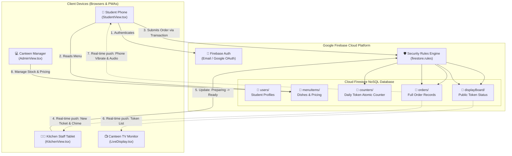
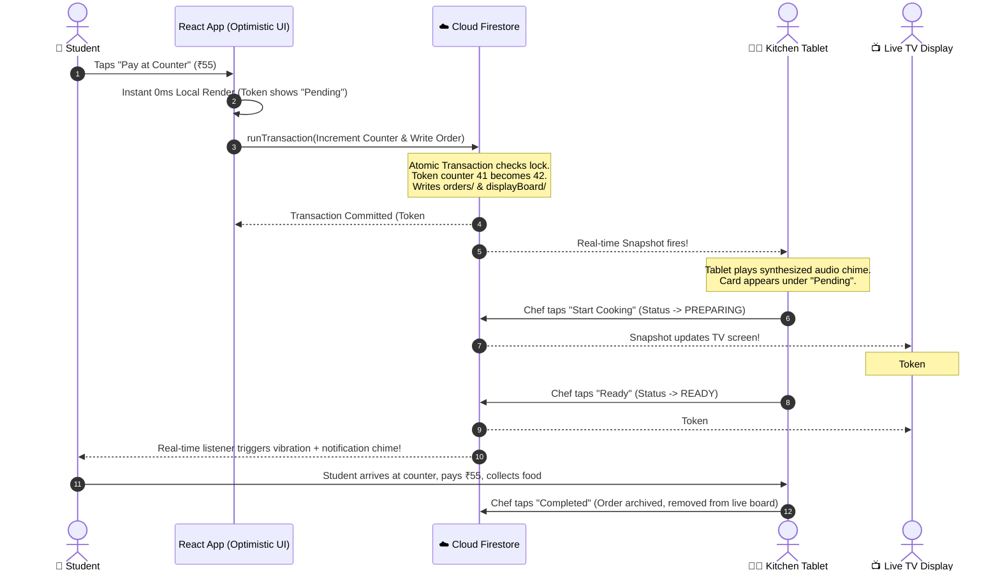

# 🍛 PICT Canteen — Real-Time Digital Queuing System

> **A First-Principles Guide to Modern Full-Stack Web Development**  
> *Built for Pune Institute of Computer Technology (PICT) to eliminate campus canteen queues.*

---

[](https://react.dev/)
[](https://www.typescriptlang.org/)
[](https://vitejs.dev/)
[](https://tailwindcss.com/)
[](https://firebase.google.com/)
[](https://web.dev/progressive-web-apps/)
[](https://opensource.org/licenses/MIT)

---

## 📖 Welcome! Start Here

If you have **never built a web application**, or if terms like *"Full-Stack"*, *"Reactive State"*, *"Real-time WebSockets"*, or *"Database Transactions"* sound intimidating, **you are in the right place**.

Most computer science tutorials teach you how to write code in isolation. They show you a syntax snippet, but they rarely explain **why** things are built the way they are. 

This repository is different. It is a production-grade, battle-tested system that was deployed at **Pune Institute of Computer Technology (PICT)** during peak college rush hours. But more than that, **this codebase is an open textbook**.

By reading this guide, you will learn the foundational principles of full-stack engineering:
1. How a button click on a phone turns into food on a kitchen counter.
2. How multiple devices across an entire campus talk to each other within milliseconds.
3. How to prevent two people from getting the same token number using atomic operations.
4. How to keep a web application running 24/7 on a $0.00 cloud budget.

Grab a cup of chai ☕, open the files alongside this guide, and let's explore from first principles.

---

## 📑 Table of Contents

- [1. The Real-World Problem: The Canteen Rush](#1-the-real-world-problem-the-canteen-rush)
- [2. What is "Full-Stack"? The Mental Model](#2-what-is-full-stack-the-mental-model)
- [3. System Architecture & End-to-End Flow](#3-system-architecture--end-to-end-flow)
- [4. Deep-Dive: Core Engineering Concepts in Code](#4-deep-dive-core-engineering-concepts-in-code)
  - [Concept 1: Component UI & Reactive State (React 19)](#concept-1-component-ui--reactive-state-react-19)
  - [Concept 2: Real-Time Sync vs. Polling (`onSnapshot`)](#concept-2-real-time-sync-vs-polling-onsnapshot)
  - [Concept 3: Concurrency & Atomic Transactions (`runTransaction`)](#concept-3-concurrency--atomic-transactions-runtransaction)
  - [Concept 4: Optimistic UI Updates (Perceived Zero Latency)](#concept-4-optimistic-ui-updates-perceived-zero-latency)
  - [Concept 5: Security Without a Backend Server (Firestore Rules)](#concept-5-security-without-a-backend-server-firestore-rules)
  - [Concept 6: The Web Audio API (Synthesizing Sounds in Code)](#concept-6-the-web-audio-api-synthesizing-sounds-in-code)
  - [Concept 7: Progressive Web Apps (PWA) & Offline Cache](#concept-7-progressive-web-apps-pwa--offline-cache)
- [5. Project Directory Anatomy](#5-project-directory-anatomy)
- [6. Application Interfaces (The 4 Views)](#6-application-interfaces-the-4-views)
- [7. Step-by-Step Installation & Local Setup](#7-step-by-step-installation--local-setup)
- [8. Zero-Cost Cloud Deployment (Firebase Spark Tier)](#8-zero-cost-cloud-deployment-firebase-spark-tier)
- [9. The First-Principles Full-Stack Glossary](#9-the-first-principles-full-stack-glossary)
- [10. Verification & Quality Assurance](#10-verification--quality-assurance)

---

## 1. The Real-World Problem: The Canteen Rush

Every great software system begins with a human frustration. 

### The Physical Bottleneck
At PICT, between 12:45 PM and 1:15 PM, over 1,000 students finish class simultaneously and head to the canteen. The physical environment presents three major bottlenecks:
1. **The Single-Counter Funnel:** One cash register handles ordering, bill calculation, payment collection, and token distribution.
2. **The Acoustic Chaos:** In a hall filled with hundreds of students, hearing your order called out is nearly impossible. Students crowd around the pickup shelf, blocking other students from reaching the counter.
3. **Information Asymmetry:** A student has no idea whether the kitchen has a 3-minute wait or a 25-minute backlog until after they have already waited in line to ask.

```
[BEFORE: Physical Bottleneck]
1,000 Students ---> [ Single Cash Counter ] ---> [ Shouted Tokens ] ---> Chaos & Cold Food
                          (Bottleneck)
```

### The Digital Queue Solution
Instead of forcing people to stand in a physical line, we decouple **ordering** from **waiting**:
1. **Remote Ordering:** A student orders from their smartphone while walking down the hallway or sitting under the trees.
2. **Instant Digital Token:** An automated, atomic counter generates token `#42`.
3. **Live Sync Display:** The student goes about their day until their phone vibrates and the campus wall monitor shows `#42` in bright green: **Ready for Pickup**.
4. **Physical Pickup Only:** The student steps up to the counter for 10 seconds, shows the digital token, pays, and picks up fresh food.

```
[AFTER: Decoupled Digital Queue]
Students on Phones ---> [ Cloud Firestore (Real-Time) ] ---> [ Kitchen Tablet ]
                                  |                                |
                        [ Student Phone Alert ]       [ Live Campus TV Board ]
                                  \                                /
                                   ---> 10s Counter Pickup <---
```

---

## 2. What is "Full-Stack"? The Mental Model

If you have never built a software system, the phrase **"Full-Stack Development"** can sound mysterious. Let's demystify it using a simple real-world analogy: **A Restaurant**.

```
+-------------------------------------------------------------------------+
|                              THE RESTAURANT                             |
+-------------------------------------------------------------------------+
| 1. FRONTEND (The Dining Room)                                           |
|    - The Menu Card, Furniture, Table Numbers, Waiter's Smile            |
|    - In Web Tech: HTML, CSS, JavaScript, React                          |
|    - What it does: Runs directly on the user's device (phone/laptop).   |
+-------------------------------------------------------------------------+
                                    |
                            (Order Slip on Wire)
                                    v
+-------------------------------------------------------------------------+
| 2. BACKEND & LOGIC (The Kitchen Manager & Rules)                        |
|    - Enforces rules: "No orders after 10 PM", "Calculate 5% tax"       |
|    - In Web Tech: Node.js, Cloud Functions, Firestore Security Rules    |
|    - What it does: Protects the system from fraud and controls flow.   |
+-------------------------------------------------------------------------+
                                    |
                            (Pantry Inventory)
                                    v
+-------------------------------------------------------------------------+
| 3. DATABASE (The Kitchen Pantry & Order Ledger)                         |
|    - Stores data permanently: How many eggs left, list of all receipts  |
|    - In Web Tech: Cloud Firestore (NoSQL Document Store)                |
|    - What it does: Remembers information even when machines restart.    |
+-------------------------------------------------------------------------+
```

### Traditional Stack vs. Serverless (Backend-as-a-Service)
Historically, to build a full-stack app, you had to run three separate servers:
1. A **Web Server** (e.g., NGINX) to send HTML to browsers.
2. An **Application Server** (e.g., Express.js / Python Django) to process requests.
3. A **Database Server** (e.g., PostgreSQL or MongoDB) to store rows.

Running three servers costs money, requires operating system patches, and goes down if college traffic spikes.

**This project uses a Serverless Architecture (BaaS — Backend-as-a-Service):**
- The frontend is compiled into static files hosted on a high-speed CDN (**Firebase Hosting**).
- The client talks directly to **Cloud Firestore**, Google's distributed real-time cloud database.
- Instead of maintaining a separate API server, security and validation are enforced using **declarative Firestore Security Rules** that execute inside Google's database engine.
- Result: **Zero server maintenance, instant auto-scaling, and $0.00 hosting cost.**

---

## 3. System Architecture & End-to-End Flow

Here is how the entire system communicates in real time across devices:



### The Life of an Order: From Click to Plate
Let's trace a student ordering a **Misal Pav (₹45)** and a **Cutting Chai (₹10)**:



---

## 4. Deep-Dive: Core Engineering Concepts in Code

Here is where we look under the hood. Each concept below powers modern web engineering.

---

### Concept 1: Component UI & Reactive State (React 19)

#### The Problem
In old-school web development (plain HTML and JavaScript), if you wanted to increment an item counter, you had to find the HTML element by ID, parse its text, add 1, and rewrite the HTML:
```javascript
// The brittle, error-prone way (Imperative DOM manipulation)
let count = parseInt(document.getElementById("badge").innerText);
document.getElementById("badge").innerText = count + 1;
```
If two scripts tried to update the screen at once, they conflicted.

#### The Modern Solution: Declarative Reactive State
In React, you do **not** touch the screen elements directly. Instead, you declare **State** (the data), and React automatically updates the screen whenever the data changes.

Look at how a dish card is defined in [`src/components/DishCard.tsx`](file:///Users/varadmalpure/foo/pict-canteen/src/components/DishCard.tsx):

```tsx
// React.memo ensures this card ONLY rerenders when its own data changes,
// preventing unnecessary slowdowns when scrolling through 70+ menu items.
export const DishCard = React.memo(function DishCard({
  item,
  cartItem,
  onAddToCart,
  onRemoveFromCart,
}: DishCardProps) {
  // Derive the quantity directly from the parent cart state
  const quantity = cartItem?.quantity || 0;

  return (
    <div className="flex items-center justify-between p-4 border-b">
      <div>
        <h3 className="font-black text-slate-950">{item.name}</h3>
        <p className="text-sm font-semibold text-slate-600">₹{item.price}</p>
      </div>

      {quantity === 0 ? (
        <button 
          onClick={() => onAddToCart(item)}
          className="bg-blue-600 text-white px-4 py-2 rounded-xl font-bold"
        >
          ADD
        </button>
      ) : (
        <div className="flex items-center gap-3 bg-blue-600 text-white rounded-xl px-3 py-1">
          <button onClick={() => onRemoveFromCart(item.id)}>-</button>
          <span className="font-black">{quantity}</span>
          <button onClick={() => onAddToCart(item)}>+</button>
        </div>
      )}
    </div>
  );
});
```

> **Why this matters:**
> Notice how clean the logic is. If `quantity === 0`, React renders the `ADD` button. If `quantity > 0`, it renders the stepper (`- 1 +`). The developer never manually edits the DOM; you change the data, and React makes the UI match the data automatically.

---

### Concept 2: Real-Time Sync vs. Polling (`onSnapshot`)

#### The Problem: HTTP Polling Wastes Network and Quota
Most web apps fetch data using standard HTTP requests:
```text
Browser: "Any new orders?"  --> Server: "No."
(1 second later)
Browser: "Any new orders?"  --> Server: "No."
(1 second later)
Browser: "Any new orders?"  --> Server: "Yes, order #42!"
```
This is called **Polling**. If 500 students poll every 2 seconds, that is 15,000 requests per minute! On a free cloud tier, your quota would exhaust in 5 minutes.

#### The First-Principles Solution: WebSocket Server Push
Instead of the browser asking repeatedly, the browser opens **one long-lived connection** to Cloud Firestore. When data changes in the cloud, the cloud pushes the new data down to the browser.

Look at [`src/components/LiveDisplay.tsx`](file:///Users/varadmalpure/foo/pict-canteen/src/components/LiveDisplay.tsx):

```typescript
useEffect(() => {
  // Create a query for only active cooking tickets
  const q = query(
    displayBoardCollection,
    where('status', 'in', ['PREPARING', 'READY']),
    limit(50)
  );

  // onSnapshot sets up an active listener.
  // The moment ANY chef updates an order in the kitchen,
  // this callback executes immediately (<50ms).
  const unsubscribe = onSnapshot(q, (snapshot) => {
    const entries = snapshot.docs.map(d => ({ id: d.id, ...d.data() }));
    setPreparingOrders(entries.filter(o => o.status === 'PREPARING'));
    setReadyOrders(entries.filter(o => o.status === 'READY'));
  });

  // Cleanup: when the component unmounts, close the connection
  return () => unsubscribe();
}, []);
```

---

### Concept 3: Concurrency & Atomic Transactions (`runTransaction`)

#### The Problem: The Double-Allocation Race Condition
Imagine two students, Aman and Priya, place an order at the exact same millisecond (12:30:00.100).
A naive implementation would do this:
1. Aman reads counter: `Current count is 40`.
2. Priya reads counter: `Current count is 40`.
3. Aman writes `40 + 1 = 41`. Aman gets Token #41.
4. Priya writes `40 + 1 = 41`. Priya ALSO gets Token #41!

Now the kitchen receives two different tickets both marked `#41`. Chaos ensues at the pickup window.

#### The Solution: Atomic Database Transactions
In computer science, **Atomic** (from the Greek *atomos*, meaning indivisible) means an operation either succeeds completely or fails completely; it can never be interrupted or split.

Here is how [`src/lib/orderService.ts`](file:///Users/varadmalpure/foo/pict-canteen/src/lib/orderService.ts) guarantees unique daily sequential tokens:

```typescript
// Atomically increment the daily token counter starting from 1 each day
const committed = runTransaction(db, async (transaction) => {
  // 1. Read the counter inside the transaction lock
  const counterSnap = await transaction.get(counterRef);
  let nextNum = 1;
  if (counterSnap.exists()) {
    nextNum = (Number(counterSnap.data().count) || 0) + 1;
  }
  assignedToken = String(nextNum);

  // 2. Prepare the order record
  const orderData = {
    uid: input.uid,
    token_number: assignedToken,
    items,
    total_amount: totalAmount,
    status: 'Pending',
    created_at: serverTimestamp(),
  };

  // 3. Commit all writes together as a single atomic unit:
  // If Priya and Aman execute simultaneously, Firestore detects the conflict,
  // automatically retries Priya's transaction with the new counter (42),
  // ensuring nobody ever receives a duplicate token number!
  transaction.set(counterRef, { count: nextNum, date: todayKey }, { merge: true });
  transaction.set(orderRef, orderData);
  transaction.set(doc(displayBoardCollection, orderRef.id), {
    token_number: assignedToken,
    status: 'Pending',
  }, { merge: true });
});
```

---

### Concept 4: Optimistic UI Updates (Perceived Zero Latency)

#### The Problem: High Latency Feels Broken
When a student on 4G taps "Place Order", sending data to a cloud data center and receiving an acknowledgment takes 300ms–800ms. In modern UX, a spinning spinner for 800ms feels sluggish.

#### The First-Principles Solution
In 99.9% of normal cases, the database write will succeed. Therefore, we **optimistically assume success** before the network even finishes:
1. Immediately render the confirmed ticket on the student's screen with `Date.now()`.
2. Send the transaction promise to the background.
3. If the network fails, roll back and display a clean error alert.

Look at the return value of `createStudentOrder` in [`src/lib/orderService.ts`](file:///Users/varadmalpure/foo/pict-canteen/src/lib/orderService.ts):

```typescript
// Fast optimistic representation for instant UI response (0ms perceived latency!)
const localOrder: Order = {
  id: orderRef.id,
  uid: input.uid,
  token_number: assignedToken,
  items,
  total_amount: totalAmount,
  status,
  created_at: Date.now(),
  payment_status: 'Pay at Counter',
  payment_method: 'Pay at Counter',
  scheduled_for: input.scheduledFor,
};

return {
  order: localOrder, // The UI updates right now!
  committed: committed.then(() => committedOrder || localOrder) // Network resolves in background
};
```

---

### Concept 5: Security Without a Backend Server (Firestore Rules)

#### The Problem: The Client is Completely Untrusted
In client-side applications, anyone can open their browser's Developer Tools (F12) or use `curl` to send arbitrary commands. What stops a malicious user from editing their cart in JavaScript and submitting:
```json
{ "name": "Veg Thali", "price": 0.01, "quantity": 10 }
```
If we do not have an Express.js server, how do we prevent fraud?

#### The First-Principles Solution: Declarative Database Security
Google Cloud Firestore evaluates **Security Rules** directly at the database gateway before any document is written or read.

Look at [`firestore.rules`](file:///Users/varadmalpure/foo/pict-canteen/firestore.rules):

```javascript
rules_version = '2';
service cloud.firestore {
  match /databases/{database}/documents {
    function signedIn() {
      return request.auth != null;
    }

    // Public display board can be read by anyone (TV monitors, students),
    // but can only be modified by signed-in users.
    match /displayBoard/{orderId} {
      allow read, list: if true;
      allow write: if signedIn();
    }

    // Orders require full authentication
    match /orders/{orderId} {
      allow read, list: if signedIn();
      allow create, update, delete: if signedIn();
    }

    // Menu is publicly visible to everyone, but only authenticated staff can edit
    match /menuItems/{itemId} {
      allow read: if true;
      allow write: if signedIn();
    }
  }
}
```

---

### Concept 6: The Web Audio API (Synthesizing Sounds in Code)

#### The Problem
In busy kitchens, chefs look down at the griddle; they don't stare at a tablet screen. When an order arrives, an auditory chime is essential. But loading an MP3 file over a poor campus network can fail, buffer, or be blocked by mobile browsers.

#### The First-Principles Solution: Pure Audio Synthesis
Instead of downloading an audio file, we use the browser's **Web Audio API** to generate raw electronic sound waves using mathematical frequencies.

Look at [`src/components/KitchenView.tsx`](file:///Users/varadmalpure/foo/pict-canteen/src/components/KitchenView.tsx):

```typescript
const playChime = useCallback(() => {
  const AudioCtx = window.AudioContext || (window as any).webkitAudioContext;
  if (!AudioCtx) return;
  const ctx = new AudioCtx();

  // Create an electronic sine wave oscillator (pure musical tone)
  const osc = ctx.createOscillator();
  const gain = ctx.createGain();

  osc.type = 'sine';
  // Slide frequency upward from 587.33 Hz (Note D5) to 880.00 Hz (Note A5)
  // This creates a pleasant, high-visibility "ding-dong" bell sound
  osc.frequency.setValueAtTime(587.33, ctx.currentTime);
  osc.frequency.exponentialRampToValueAtTime(880, ctx.currentTime + 0.15);

  // Smooth decay envelope so the sound doesn't click
  gain.gain.setValueAtTime(0.3, ctx.currentTime);
  gain.gain.exponentialRampToValueAtTime(0.01, ctx.currentTime + 0.4);

  osc.connect(gain);
  gain.connect(ctx.destination);
  osc.start();
  osc.stop(ctx.currentTime + 0.4);
}, []);
```
> **Zero assets, zero bytes downloaded, 100% reliable.**

---

### Concept 7: Progressive Web Apps (PWA) & Offline Cache

#### The Problem: College Wi-Fi Drops Frequently
When hundreds of students walk between classrooms, Wi-Fi connections frequently drop or switch access points. A standard website crashes or shows a "No Internet" dinosaur.

#### The Solution: Progressive Web App Architecture
In [`src/firebase.ts`](file:///Users/varadmalpure/foo/pict-canteen/src/firebase.ts), Firestore's persistent offline engine is configured:

```typescript
export const db = initializeFirestore(app, {
  localCache: persistentLocalCache({
    tabManager: persistentMultipleTabManager()
  })
});
```

1. **Persistent IndexedDB Cache:** The entire menu is cached in the browser's local database. When a student opens the app, the menu loads in **0 milliseconds**, even with zero connectivity.
2. **Multi-Tab Sync:** If a student opens the canteen in two tabs, they share a single synchronization engine, preventing redundant network connections.
3. **PWA Install Banner:** [`src/components/PWAInstallPrompt.tsx`](file:///Users/varadmalpure/foo/pict-canteen/src/components/PWAInstallPrompt.tsx) allows students to tap **"Add to Home Screen"**, giving the web app a native app icon on Android and iOS without needing the Google Play Store or Apple App Store.

---

## 5. Project Directory Anatomy

Here is how the repository is structured, organized by architectural layer:

```text
pict-canteen/
├── public/                     # Static assets served directly (icons, manifest, sounds)
│   ├── favicon.ico
│   ├── pwa-192x192.png         # PWA home screen icon
│   ├── pwa-512x512.png
│   └── notification.mp3        # Pickup notification chime
├── src/
│   ├── assets/                 # SVGs, banners, and brand images
│   ├── components/             # Reusable UI building blocks
│   │   ├── AdminView.tsx       # 🛠️ Manager portal: stock toggles, pricing, sales analytics
│   │   ├── CartReviewView.tsx  # 🛒 Checkout drawer: item list, pickup slot, submit button
│   │   ├── DishCard.tsx        # 🍱 Individual dish row with instant stepper & badges
│   │   ├── FoodDetailModal.tsx # 🔍 Nutritional card: calories, protein, carbs, ingredients
│   │   ├── KitchenView.tsx     # 🧑‍🍳 High-contrast kitchen display with audio chime
│   │   ├── LiveDisplay.tsx     # 📺 Full-screen TV board for canteen wall monitors
│   │   ├── Navbar.tsx          # 🧭 Header navigation, active orders counter, theme picker
│   │   ├── OrderTrackerModal.tsx# 🎫 Active order ticket overlay with live status pill
│   │   ├── PWAInstallPrompt.tsx# 📲 Native install banner for Android & iOS
│   │   ├── RushMeter.tsx       # ⏱️ Visual load gauge (Low, Moderate, Peak Rush)
│   │   ├── StudentAuth.tsx     # 🔐 Email/Password and Google OAuth login modal
│   │   ├── StudentProfile.tsx  # 👤 Student details, order history, and sign-out
│   │   ├── StudentView.tsx     # 📱 Main student menu, category filter, instant search
│   │   └── ThemeSelector.tsx   # 🎨 Real-time color switcher (Chai, Slate, Emerald, etc.)
│   ├── lib/                    # Core business logic and cloud services
│   │   ├── adminAuth.ts        # Staff role checks and automatic admin document setup
│   │   ├── foodDetails.ts      # Calorie and macro registry for canteen staples
│   │   ├── orderService.ts     # Atomic Firestore transactions for order submission
│   │   ├── ThemeContext.tsx    # Global CSS variable injection for live themes
│   │   └── timeUtils.ts        # 15-minute pickup slot generator & IST time formatters
│   ├── App.tsx                 # Root application component: routing & auth hydration
│   ├── firebase.ts             # Firebase SDK client initialization & local cache setup
│   ├── initDb.ts               # Database seeder (pre-loads 40+ authentic Pune dishes)
│   ├── main.tsx                # React application entry point (mounts to DOM)
│   └── types.ts                # TypeScript data interfaces (MenuItem, Order, OrderItem)
├── firestore.rules             # Declarative database security and write authorizations
├── firestore.indexes.json      # Composite cloud database query indexes
├── firebase.json               # Firebase Hosting and Firestore deployment definitions
├── vite.config.ts              # Vite bundler config with Rollup manual chunk splitting
├── package.json                # Project dependencies, scripts, and build tooling
└── README.md                   # This interactive guide!
```

---

## 6. Application Interfaces (The 4 Views)

The application provides four dedicated interfaces designed for distinct users and devices:

| View | Route | Primary Device | Key Capabilities |
| :--- | :--- | :--- | :--- |
| **Student Menu** | `/` | Smartphone (Mobile) | Browse 70+ dishes, live search, calorie details, 15-min pickup slot scheduling, 0ms optimistic ordering, vibrating pickup alerts. |
| **Kitchen Display (KDS)** | `/kitchen` | 10" Tablet (Landscape) | High-contrast tickets, Web Audio synthesizer chime, 1-tap state buttons (`Pending` → `Preparing` → `Ready` → `Completed`). |
| **Live TV Board** | `/live` | 55" Wall Monitor | Split-screen display: *Preparing Now* (Amber) and *Ready for Pickup* (Bouncing Green). Readable from 30 feet away. |
| **Manager Portal** | `/admin` | Laptop / Desktop | Live inventory toggle (*Available* / *Out of Stock*), real-time pricing editor, dish additions, revenue analytics. |

---

## 7. Step-by-Step Installation & Local Setup

Want to run this project on your computer? Follow this first-principles guide.

### Prerequisites
You only need two things installed on your computer:
1. **[Node.js](https://nodejs.org/)** (v18.0.0 or higher) — Runs JavaScript outside the browser.
2. **[Git](https://git-scm.com/)** — Version control tool to download the code.

Check your installation in your terminal:
```bash
node -v
npm -v
git --version
```

---

### Step 1: Clone the Repository
Open your terminal and run:
```bash
git clone https://github.com/varadmalpure-ops/pict-canteen.git
cd pict-canteen
```

---

### Step 2: Install Project Dependencies
Download all libraries specified in `package.json`:
```bash
npm install
```

---

### Step 3: Create a Free Firebase Project
This project uses Firebase's permanently free **Spark Plan**.
1. Navigate to the [Firebase Console](https://console.firebase.google.com/) and click **"Add project"**.
2. Name your project (e.g., `my-pict-canteen`) and disable Google Analytics (optional).
3. Once created, click the **Web icon (`</>`)** to register a web application.
4. Copy the `firebaseConfig` object displayed on screen.

---

### Step 4: Configure Authentication & Database in Firebase
Inside the Firebase Console:
1. **Enable Authentication:**
   - Go to **Build** → **Authentication** → **Sign-in method**.
   - Enable **Email/Password**.
   - Enable **Google** (set your project support email).
2. **Enable Cloud Firestore:**
   - Go to **Build** → **Firestore Database** → click **Create database**.
   - Choose a location close to your users (e.g., `asia-south1` for Mumbai).
   - Start in **Test mode** (we will deploy strict rules later).

---

### Step 5: Configure Environment Variables
In the root directory of the project, create a `.env` file by copying the example:
```bash
cp .env.example .env
```
Open `.env` in your text editor and fill in your Firebase project values:
```env
VITE_FIREBASE_API_KEY=AIzaSy...YourKey
VITE_FIREBASE_AUTH_DOMAIN=your-project.firebaseapp.com
VITE_FIREBASE_PROJECT_ID=your-project
VITE_FIREBASE_MESSAGING_SENDER_ID=123456789
VITE_FIREBASE_APP_ID=1:123456789:web:abcdef
```

---

### Step 6: Start the Local Development Server
Run Vite's lightning-fast local development server:
```bash
npm run dev
```
You will see output similar to:
```text
  VITE v6.x.x  ready in 240 ms

  ➜  Local:   http://localhost:5173/
  ➜  Network: use --host to expose
```
Open `http://localhost:5173/` in your browser. The application is running!

---

### Step 7: Seed the Database with Authentic Pune Canteen Items
When you first open the app, your database is empty. You can seed it with authentic college staples (Misal Pav, Vada Pav, Kanda Poha, Cutting Chai) by calling the built-in database initializer.
1. Open [`src/initDb.ts`](file:///Users/varadmalpure/foo/pict-canteen/src/initDb.ts).
2. In your browser console on the student page, or by temporarily calling `initializeDatabase()` in `App.tsx`, the menu collection will populate with 40+ authentic dishes and prices.

---

## 8. Zero-Cost Cloud Deployment (Firebase Spark Tier)

This application is engineered specifically to operate **100% free of charge** under Firebase's Spark tier limits.

### Understanding the Free Spark Quota
| Resource | Spark Free Tier Limit | How This App Conserves Quota |
| :--- | :--- | :--- |
| **Firestore Reads** | 50,000 reads / day | Menu is cached in browser `localStorage`. Reads happen only when data actually changes. |
| **Firestore Writes** | 20,000 writes / day | Atomic batches group order, counter, and board creation into one single commit. |
| **Firestore Deletes** | 20,000 deletes / day | Completed tickets are purged from the public display board to keep queries tiny. |
| **Hosting** | 10 GB storage, 360 MB/day | Static assets are minified and compressed with Rollup chunking (<600 KB initial bundle). |

### Deploying to Production in One Command
Install the Firebase CLI globally if you haven't already:
```bash
npm install -g firebase-tools
firebase login
```
Deploy the compiled frontend and security rules:
```bash
npm run deploy
```
Your canteen system is now live on a global CDN at `https://<your-project-id>.web.app`!

---

## 9. The First-Principles Full-Stack Glossary

Use this cheat sheet to master the technical terms used across this repository:

| Term | First-Principles Explanation |
| :--- | :--- |
| **SPA (Single Page Application)** | A website that loads a single HTML file once. When you click links, JavaScript rewires the page without the browser having to reload. |
| **DOM (Document Object Model)** | The browser's internal tree representation of HTML tags on the screen. |
| **State** | The memory of a program at any specific moment (e.g., "There are 2 items in the cart"). |
| **Props** | Inputs passed from a parent React component to a child component (like arguments to a mathematical function). |
| **Hook (`useState`, `useEffect`)** | Special functions in React that let you "hook" into component state and lifecycle events. |
| **BaaS (Backend-as-a-Service)** | Using managed cloud infrastructure (like Firebase or Supabase) instead of writing and hosting your own server. |
| **NoSQL Document Database** | A database that stores information in flexible JSON-like documents (records) inside collections (folders), rather than fixed SQL tables. |
| **Atomic Transaction** | A database operation where multiple steps are bound together. Either all succeed, or none do. Prevents corrupt or partial data. |
| **Race Condition** | A bug that occurs when two events happen in an unexpected order because they were executing at the same time. |
| **Optimistic UI** | Updating the visual screen immediately before the network confirmation returns, giving the perception of zero latency. |
| **WebSocket** | A persistent two-way communication pipe between a browser and a server, enabling instant real-time data push. |
| **PWA (Progressive Web App)** | A website built with web technologies that behaves like an installed mobile app on your phone. |
| **Composite Index** | A database lookup structure that indexes two or more fields together (e.g., `uid` + `status`), making complex queries lightning-fast. |
| **Rollup / Bundler** | A build tool (used inside Vite) that scans your code, removes unused parts (tree-shaking), and combines files into compact bundles. |

---

## 10. Verification & Quality Assurance

To ensure the codebase remains robust and error-free:

### Code Linting
Run [Oxlint](https://oxc.rs/), a high-performance JavaScript/TypeScript linter:
```bash
npm run lint
```

### Type Checking & Production Build
Ensure all TypeScript types match without compile errors:
```bash
npm run build
```

---

## 🤝 Contributing

Contributions are welcome! Whether it's adding UPI payment gateway integration, enhancing accessibility, or optimizing database queries:
1. Fork the Project.
2. Create your Feature Branch (`git checkout -b feature/AmazingFeature`).
3. Commit your Changes (`git commit -m 'Add some AmazingFeature'`).
4. Push to the Branch (`git push origin feature/AmazingFeature`).
5. Open a Pull Request.

---

## 📜 Academic Attribution & License

Developed as part of the **Community Engagement Project (CEP)** at **Pune Institute of Computer Technology (PICT)**, Pune, Maharashtra, India.

Distributed under the **MIT License**. Feel free to adapt this project for your own college canteen, cafeteria, or community kitchen!
